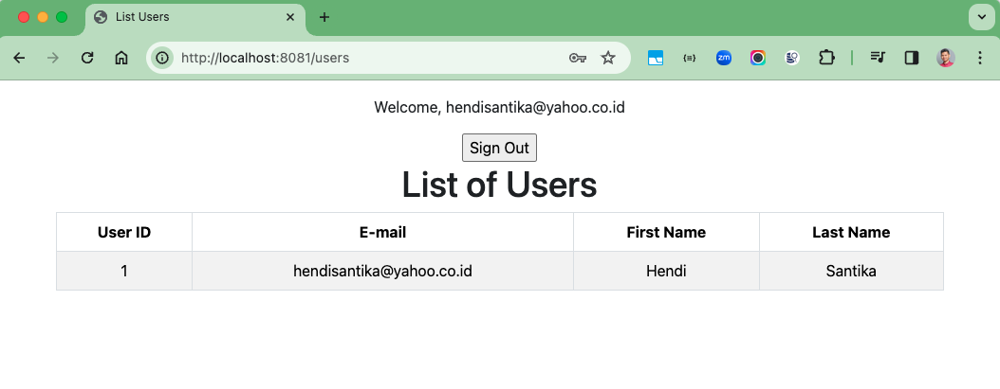

# spring-boot-email-verification

### Things todo list

1. Clone this repository: `git clone https://github.com/hendisantika/spring-boot-email-verification.git`
2. Navigate to the folder: `cd spring-boot-email-verification`
3. Change with your DB credentials & SMTP configuration in `application.properties`
4. Run the application: `mvn clean spring-boot:run`
5. Open your favorite browser: http://localhost:8081

### Image Screen shots

Menu Page

Signup Page

Check Email Verification

Click Email Verification

Click Email Verification Error

Login Page

Bad Credentials Page

Success Page

List Users Page

